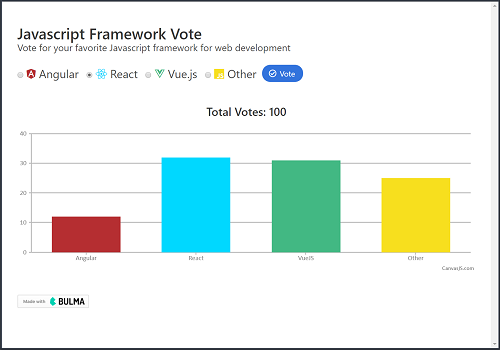

# Pusher Polling App
This project is the result of my code-along to the Pusher Polling App, [Node.js & Pusher Real Time Polling App](https://www.youtube.com/watch?v=SSDED3XKz-0&t=9s) by *Brad Traversy*.  The app uses [Pusher](https://pusher.com), a platform to build realtime apps as well as [CanvasJS](https://canvasjs.com/), a responsive HTML5 charting library.  There were several bugs found in the original app with solutions detailed below.  In addition, the content of this app has been slightly modified from the original and styled using the [Bulma CSS Framework](https://bulma.io).

<p align="center">
    <br>
</p>

## Versions
* [Bulma](https://bulma.io) v0.6.2
* [CanvasJS](https://canvasjs.com/) v1.7.0
* Express v4.16.2
* MongoDB v3.6.0 (Mongoose v5.0.2)
* Node v9.4.0
* [Pusher](https://pusher.com) v1.5.1

# Code Updates to Original Project
## Updating the Chart Title to Display Total Votes
When a user voted, the chart title was not updated in realtime along with the chart.  The reason for this is that in the `main.js` file, the `fetch` function that called the GET request at the `http://localhost:3000/poll` endpoint only fires once after the webpage is loaded.  Therefore, even though the user is voting, the title is not being updated!  

There may be a more elegant solution, but the one I came up with was to de-couple the chart title by deleting

```typescript
title: {
    text: `Total Votes ${totalVotes}`
},
```

from the `CanvasJS.Chart` in `main.js` and instead create a `<p>` element in `index.html` right above the chart to emulate the chart title.  The displayed `totalVotes` value in this HTML Element is then updated using the `setInterval()` function.

1. Create the Chart Title in `index.html`

    ```html
        <br><br>
        <p class="title is-size-4 has-text-centered" id="chartTitle"></p>  <!-- Bulma CSS classes used -->
        <div class="chart" id="chartContainer"></div>
    ```
    
1. Add the `setInterval()` function to `main.js`

    ```typescript
    // Loads on Startup
    fetch('http://localhost:3000/poll')
    .then(res => res.json())
    .then(data => {
        const votes = data.votes;
        const totalVotes = votes.length;

         // Add text content to the HTML element
        document.querySelector('#chartTitle').textContent=`Total Votes: ${totalVotes}`;

        // Refresh the Total Votes every 2 seconds
        setInterval(() => {
        fetch('http://localhost:3000/poll')
            .then(res => res.json())
            .then(data => document.querySelector('#chartTitle').textContent = `Total Votes: ${data.votes.length}`)
            .catch(err => console.log(err));
        }, 2000);

        ...
    ```

## Realtime Chart Display if no Votes Exist in the Database
If the user starts the application with a fresh database (ie. no votes have yet been cast), the chart will not display voting in realtime until **all categories have at least 1 vote**.  One solution is to set the initial properties in the `voteCounts` object to 0 if the object is found to be empty using the code below in `main.js`

```typescript
    // Set initial Data Points - example adapted to be consistent with Brad's original project
    if (Object.keys(voteCounts).length === 0 && voteCounts.constructor === Object) {
      voteCounts.Windows = 0;
      voteCounts.MacOS = 0;
      voteCounts.Linux = 0;
      voteCounts.Other = 0;
    }
```


# Cloning the Project for Personal Use
## Installation
1. `cd` into the folder of the cloned repo
1. Run `yarn install` to install dependencies
1. Configure your keys file `config/keys.js`
    * From the root directory, create the keys file `touch config/keys.js`
    * Enter your API keys for `Pusher` and `MongoDB` into `keys.js`

        ```typescript
        module.exports = {
        mongoURI: '',
        pusherAppId: '',
        pusherKey: '',
        pusherSecret: '',
        pusherCluster: '',
        pusherEncrypted: true
        };
        ```

1. Run `ng serve`, and navigate to `http://localhost:4200/`
